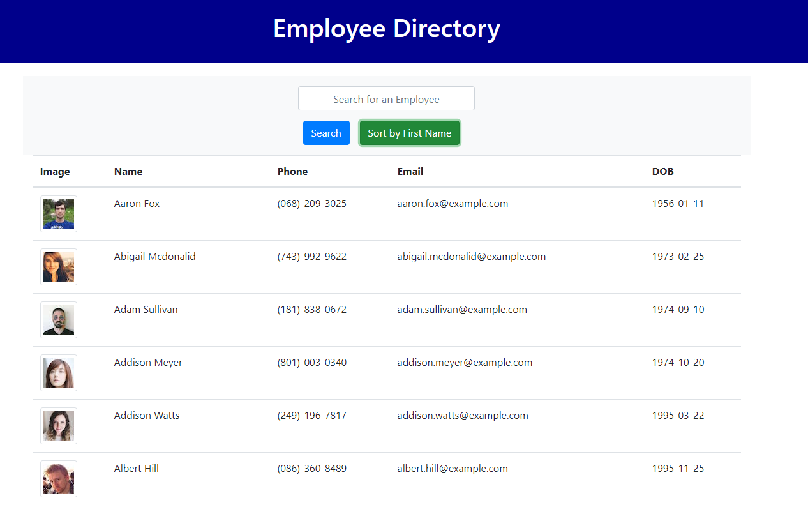

# README Generator

## Description 

Employee Directory provides a clean and sortable table of randomly generated "employees" from [Randomuser.me](https://randomuser.me/).

* [Github Repository](https://github.com/kirsralk/Employee-Directory).  
* [Deployed Version](https://kirsralk.github.io/Employee-Directory).  
* App Screenshot:


### User Story

```
As a user, 
I want to be able to view my entire employee directory at once,
So that I have quick access to their information.

```

### Business Context

An employee or manager would benefit greatly from being able to view non-sensitive data about other employees. It would be particularly helpful to be able to filter employees by name.


## Installation & Usage

Note: This application runs on a Command Line Interface only (not in a browser).


## Credits

Created by Kirsi: https://github.com/kirsralk/


## License

[](https://opensource.org/licenses/MIT)

